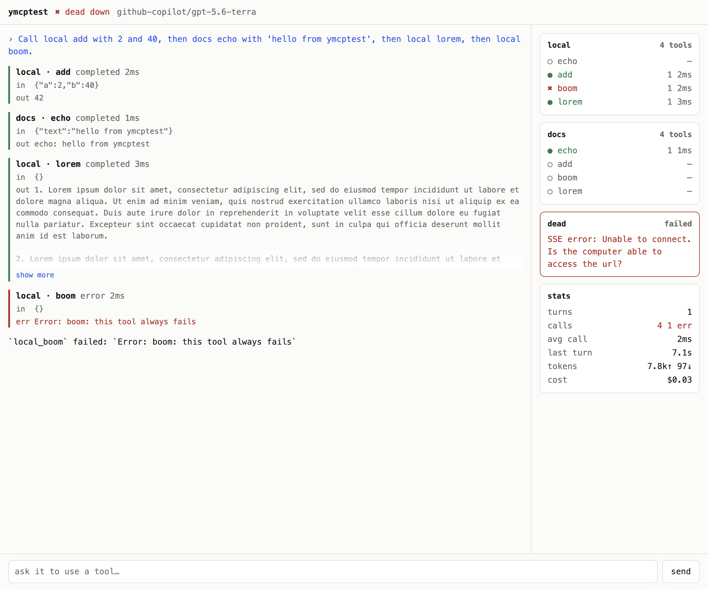

# ynfra / ymcprobe

A chat box for remote MCP servers, in the terminal or the browser. Point it at
one or more URLs, type a real prompt, and watch which tools the model actually
calls and with what arguments — MCP Inspector's job, but driven by an LLM
instead of a form. It reuses your existing `opencode` auth, so there is no
separate API key and no account.



## Prerequisites

- `bun` and `opencode` on `PATH`
- At least one authenticated provider (`opencode auth login`)

## Usage

```bash
make            # target list, variables and examples
make install    # dependencies

make distribute # build ./ymcprobe and symlink it onto PATH

ymcprobe http://localhost:8080/mcp

# chat against one MCP server
bun run src/cli.tsx http://localhost:8080/mcp

# several at once; names are derived from the host, or given as name=url
bun run src/cli.tsx local=http://localhost:8080/mcp docs=https://mcp.example.com/mcp

# browser UI instead of the TUI
bun run src/cli.tsx http://localhost:8080/mcp --web

# auth headers and a specific model
bun run src/cli.tsx https://mcp.example.com/mcp \
  -H "Authorization: Bearer $TOKEN" -m claude-haiku-4.5

# just dump what every server advertises, no LLM
bun run src/cli.tsx http://localhost:8080/mcp --json

# try it against the bundled fixture (echo, add, boom, lorem)
bun run fixture &
bun run src/cli.tsx http://127.0.0.1:8080/mcp
```

## Commands

| Command | Key fact | Description |
|---|---|---|
| `bun run src/cli.tsx <url>...` | spawns `opencode serve` on `:4179` | TUI with a live tool trace |
| `bun run src/cli.tsx <url>... --web` | browser UI on `:4180` | Same trace, same reducer, in a page |
| `bun run src/cli.tsx <url>... --json` | no opencode boot | Print every server's `tools/list` and exit |
| `bun run src/cli.tsx --models` | no MCP url needed | List authenticated providers and models |
| `bun run fixture` | `:8080/mcp`, `PORT=` to move it | 4-tool MCP server for testing ymcprobe itself |
| `bun run preview` | no LLM, no server | Render the TUI against scripted events |
| `bun run smoke` | needs the fixture running | End-to-end check that tool events still arrive |
| `make install` | `bun install` | Install dependencies |
| `make build` | `./ymcprobe`, ~62 MB | Compile the standalone binary |
| `make distribute` | `PREFIX=~/.local/bin` | Build, then symlink it onto PATH |
| `make uninstall` | | Remove what `distribute` put there |
| `make clean` | | Drop the binary and build scratch files |
| `bun run typecheck` | `tsc --noEmit` | Type check |

`make` wraps the common paths: `make run URL=…`, `make web URL=…`,
`make json URL=…`, `make fixture PORT=8081`, `make preview`, `make smoke`.
Extra flags go through as `ARGS='…'`.

Flags: `-H/--header` (repeatable), `-m/--model`, `--models`, `-p/--port`,
`--system <text>`, `--no-system`, `--all-tools`, `--web`, `--json`, `-h`.

`--model` takes a bare model id (`glm-5.3`), a unique substring (`haiku`), or
`provider/model`. The default is `github-copilot/gpt-5.6-terra`.

## Notes

- **A system prompt tells the model this is a test harness**: call the tools
  rather than answering from memory, do exactly what was asked even when
  another tool would answer better, treat "test every tool" as "call each one
  once", and report failures verbatim. Without it the model answers from its
  own knowledge and you learn nothing. Override with `--system`, drop it with
  `--no-system`.
- opencode's built-in tools (`bash`, `read`, `edit`, …) are **muted by
  default**, so everything in the trace came from a server under test. Pass
  `--all-tools` to put them back.
- The sidebar counts calls and average latency per advertised tool, grouped by
  server. A tool sitting at `○ —` after a few turns is one the model never
  reaches for — usually a description problem, not a wiring problem.
- An unreachable server is a warning, not a fatal error; ymcprobe starts as
  long as one server answers, and shows the rest as failed.
- Long tool output is clamped in the web UI with a **show more** toggle, and
  truncated to one line each in the TUI. One chatty tool otherwise pushes the
  whole trace off screen.
- `make distribute` symlinks rather than copies, so the next `make build` is
  live with no reinstall. The flip side: `make clean` leaves the symlink
  dangling and `ymcprobe` is "command not found" until you build again.
- **`bun build --compile` leaks a 63 MB scratch file per run.** `make build`
  sweeps them itself; `make clean` also drops the binary, and `make distclean`
  takes `node_modules` with it.
- The compiled binary still needs **`opencode` on PATH** — it embeds ymcprobe,
  not the agent it drives.
- Permission prompts are auto-approved. This is a test harness, so do not aim
  it at an MCP server whose tools have real side effects.
- TUI keys: `esc` interrupts a turn, `ctrl-u` clears the line, `ctrl-w` rubs
  out a word, `/quit` exits.

See [AGENTS.md](AGENTS.md) for conventions, internals, and day-2 operations.
